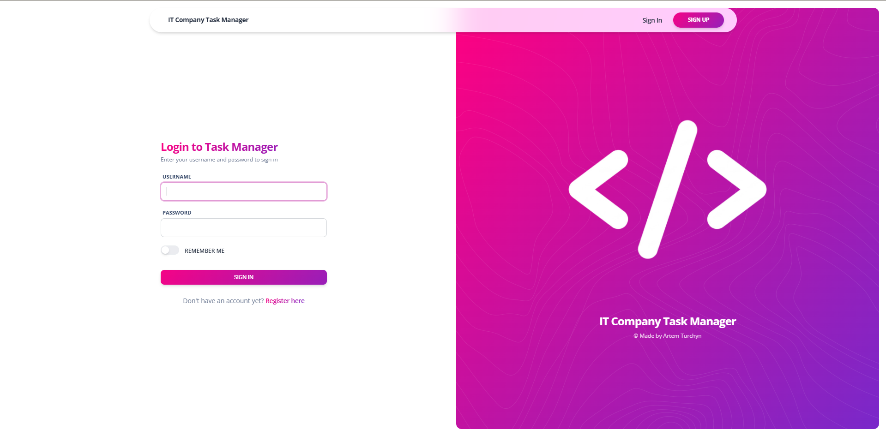
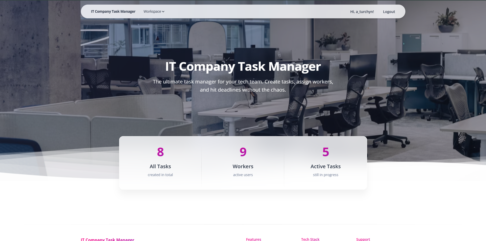
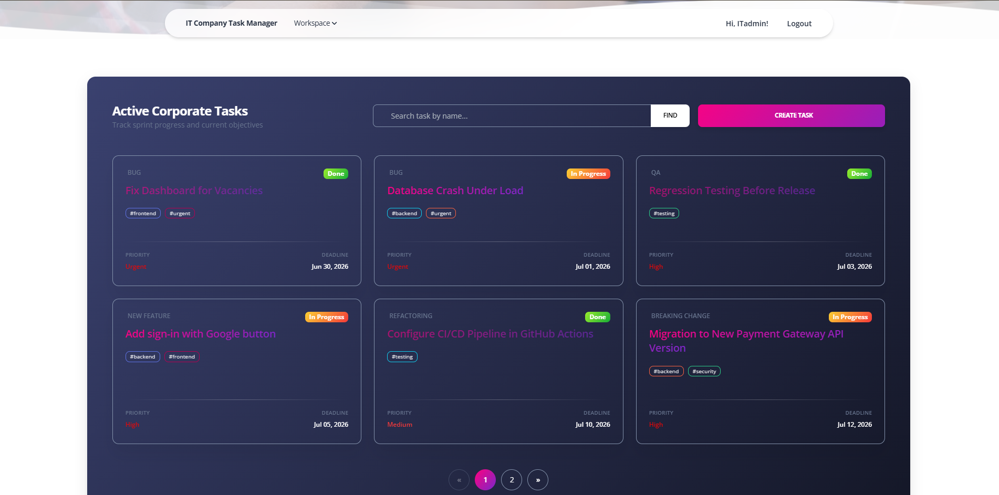
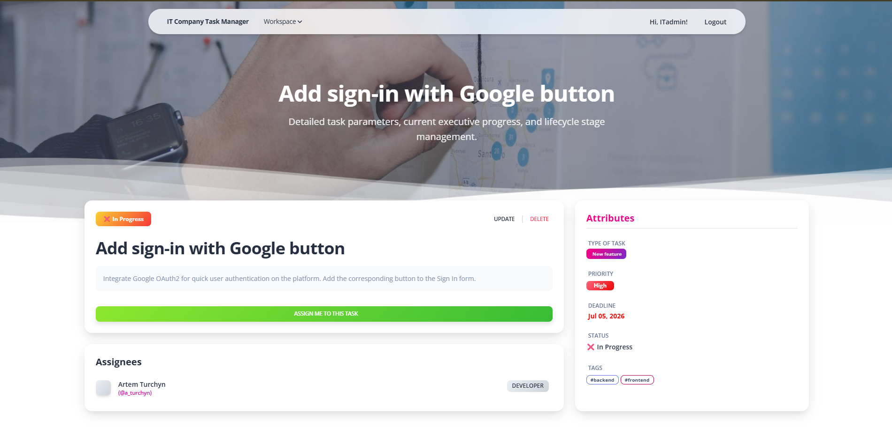
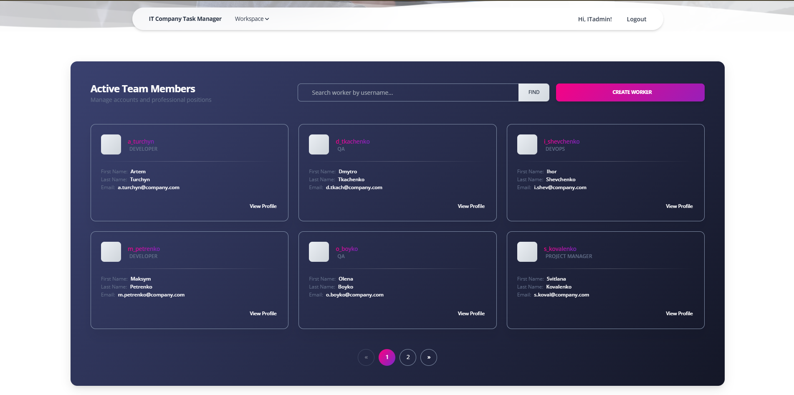

# 🚀 IT Company Task Manager

IT Company Task Manager is a web application for managing tasks, workers, positions, task types, and tags within an IT company. It provides authentication, task assignment, search, pagination, and an admin interface built with Django.

## 🌐 Live Demo

[Live Demo](https://it-company-task-manager-qa9r.onrender.com)

## ⚙️ Installation

Make sure Python 3.14+ is installed.

```shell
git clone https://github.com/X08AT/it-company-task-manager.git
cd it-company-task-manager
python3 -m venv venv

# For Windows:
venv\Scripts\activate

# For macOS/Linux:
source venv/bin/activate

pip install -r requirements.txt
cp .env.sample .env

python manage.py migrate
python manage.py createsuperuser # Create admin account if needed
python manage.py runserver
```

Configure the environment variables in `.env`.

## ✨ Features

* Authentication and authorization
* Task management (CRUD)
* Worker management
* Position management
* Task type management
* Tag management
* Task assignment/unassignment
* Search and pagination
* Django Admin interface

## 🛠️ Tech Stack
* **Backend:** Python 3.14+, Django 6
* **Frontend:** Bootstrap 5
* **Database:** PostgreSQL (Production), SQLite (Development)
* **Deployment:** Render

## 📸 Demo




